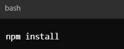
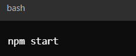

# Social-Network-API

## Description

The Social Network API is a RESTful API for a social network web application that allows users to share their thoughts, react to friends’ thoughts, and create a friend list. Built with Express.js for routing, MongoDB for the database, and Mongoose as the ODM, this API supports various operations for managing users and thoughts. It includes features for creating, updating, and deleting users and thoughts, as well as adding/removing friends and creating/deleting reactions.

## Features

- User Management: Create, read, update, and delete user profiles.
- Thought Management: Share, update, and delete thoughts.
- Reactions: Add and delete reactions to thoughts.
- Friends: Add and remove friends from a user’s friend list.
- Data Formatting: Automatically formats timestamps for better readability.

## Installation

Prerequisites
- Ensure you have the following installed on your machine:
    - Node.js (version 16 or higher)
    - MongoDB (for local development) or a MongoDB Atlas account
Steps to Install
- Clone the Repository
- Install the Dependencies 

- Set up Environment Variables
- Start the Server by entering the command below: 

## Usage and Testing 

API Endpoints
- Users
   - GET /api/users - Retrieve all users.
   - GET /api/users/:userId - Retrieve a user by ID.
   - POST /api/users - Create a new user.
   - PUT /api/users/:userId - Update a user by ID.
   - DELETE /api/users/:userId - Delete a user by ID.
   - POST /api/users/:userId/friends/:friendId - Add a friend.
   - DELETE /api/users/:userId/friends/:friendId - Remove a friend.

- Thoughts
   - GET /api/thoughts - Retrieve all thoughts.
   - GET /api/thoughts/:thoughtId - Retrieve a thought by ID.
   - POST /api/thoughts - Create a new thought.
   - PUT /api/thoughts/:thoughtId - Update a thought by ID.
   - DELETE /api/thoughts/:thoughtId - Delete a thought.
   - POST /api/thoughts/:thoughtId/reactions - Add a reaction to a thought.
   - DELETE /api/thoughts/:thoughtId/reactions/:reactionId - Remove a reaction from a thought.

Testing
 - Use tools like Insomnia or Post to test the API endpoints. 

## Links

Repository Link: https://github.com/Alondra1752/Social-Network-API

### Video Demonstration

You can watch a demonstration of the Social Network API: 

https://drive.google.com/file/d/1rL879Bp0fwsv_OJlNaJ9f2wgglAIL6EN/view?usp=sharing

## License 
This project is licensed under MIT License. For more information please click on the badge below: 

 

    
